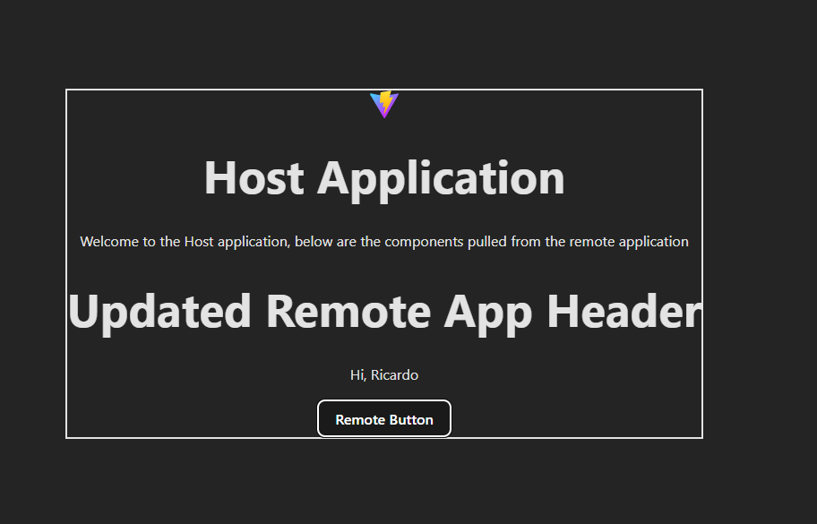

# Micro-Frontends with Module Federation

A practical implementation of micro-frontend architecture using Vite, React, and Module Federation. This project demonstrates how to build scalable applications by splitting them into smaller, independently deployable units.



## Overview

This project showcases a micro-frontend architecture with two applications:

- **host-app**: The container application that consumes remote components
- **remote-app**: The remote application that exposes components for consumption

The applications communicate through **Module Federation**, allowing them to share code at runtime while maintaining independent development and deployment cycles.

## Architecture

### Host Application (Port 5000)
The host application is the main container that:
- Runs on `http://localhost:5000`
- Consumes remote components from the remote application
- Implements lazy loading with React.Suspense for optimal performance
- Provides loading states while fetching remote modules

### Remote Application (Port 5001)
The remote application exposes shared components:
- Runs on `http://localhost:5001`
- Exposes two components:
  - `Header`: A customizable header component
  - `Button`: A reusable button component with click handlers
- Serves as an independent micro-frontend that can be deployed separately

## Tech Stack

- **React 19.2**: Modern React with latest features
- **TypeScript 5.9**: Type-safe development
- **Vite 7.2**: Fast build tool and dev server
- **Module Federation**: Runtime code sharing via `@originjs/vite-plugin-federation`
- **Tailwind CSS 4.1**: Utility-first CSS framework
- **SWC**: Fast TypeScript/JavaScript compiler
- **ESLint**: Code quality and consistency
- **Vitest 4.0**: Fast unit testing framework
- **React Testing Library**: Testing utilities for React components

## Prerequisites

- Node.js (v18 or higher recommended)
- npm or yarn package manager

## Getting Started

### Installation

1. Clone the repository:
```bash
git clone <repository-url>
cd micro-frontends
```

2. Install dependencies for both applications:
```bash
# Install host-app dependencies
cd host-app
npm install

# Install remote-app dependencies
cd ../remote-app
npm install
```

### Running the Applications

You need to run both applications simultaneously for the micro-frontend setup to work.

#### Terminal 1 - Remote Application
```bash
cd remote-app
npm run dev
```
The remote app will start on `http://localhost:5001`

#### Terminal 2 - Host Application
```bash
cd host-app
npm run dev
```
The host app will start on `http://localhost:5000`

**Important**: Always start the remote application first, as the host depends on it.

### Building for Production

Build both applications:

```bash
# Build remote-app
cd remote-app
npm run build

# Build host-app
cd host-app
npm run build
```

Serve the production builds:

```bash
# Serve remote-app (Terminal 1)
cd remote-app
npm run serve

# Serve host-app (Terminal 2)
cd host-app
npm run serve
```

## Project Structure

```
micro-frontends/
├── host-app/                 # Container application
│   ├── src/
│   │   ├── components/
│   │   │   └── RemoteComponentWrapper.tsx   # Wrapper for remote components
│   │   ├── tests/            # Test files
│   │   │   ├── App.test.tsx
│   │   │   ├── RemoteComponentWrapper.test.tsx
│   │   │   └── setup.ts      # Test setup and configuration
│   │   ├── App.tsx
│   │   └── main.tsx
│   ├── vite.config.ts        # Vite + Module Federation config
│   ├── vitest.config.ts      # Vitest configuration
│   └── package.json
│
├── remote-app/               # Remote component provider
│   ├── src/
│   │   ├── components/
│   │   │   ├── Button.tsx    # Exposed button component
│   │   │   └── Header.tsx    # Exposed header component
│   │   ├── tests/            # Test files
│   │   │   ├── Button.test.tsx
│   │   │   ├── Header.test.tsx
│   │   │   └── setup.ts      # Test setup and configuration
│   │   ├── App.tsx
│   │   └── main.tsx
│   ├── vite.config.ts        # Vite + Module Federation config
│   ├── vitest.config.ts      # Vitest configuration
│   └── package.json
│
└── imgs/
    └── app.png               # Screenshot
```

## Module Federation Configuration

### Host Configuration
```typescript
federation({
  name: "host_app",
  remotes: {
    remote_app: "http://localhost:5001/assets/remoteEntry.js",
  },
  shared: ["react", "react-dom"],
})
```

### Remote Configuration
```typescript
federation({
  name: "remote_app",
  filename: "remoteEntry.js",
  exposes: {
    "./Button": "./src/components/Button",
    "./Header": "./src/components/Header",
  },
  shared: ["react", "react-dom"],
})
```

## How It Works

1. **Remote App Exposes Components**: The remote application uses Module Federation to expose specific components through the `remoteEntry.js` file

2. **Host App Consumes Components**: The host application imports these remote components using React.lazy():
   ```tsx
   const RemoteHeader = React.lazy(() => import("remote_app/Header"));
   const RemoteButton = React.lazy(() => import("remote_app/Button"));
   ```

3. **Runtime Loading**: Components are fetched at runtime, not bundled together, allowing for:
   - Independent deployments
   - Shared dependencies (React, React-DOM)
   - Lazy loading and code splitting
   - Reduced bundle sizes

## Testing

This project includes comprehensive test suites for both applications using Vitest and React Testing Library.

### Running Tests

Run tests for each application:

```bash
# Test remote-app
cd remote-app
npm test

# Test host-app
cd host-app
npm test
```

### Test Coverage

Generate coverage reports:

```bash
# Coverage for remote-app
cd remote-app
npm run test:coverage

# Coverage for host-app
cd host-app
npm run test:coverage
```

### Test UI (Interactive Mode)

Run tests in interactive UI mode:

```bash
npm run test:ui
```

### Test Structure

**Remote App Tests:**
- `Button.test.tsx`: Tests for the Button component including rendering, props, click handlers, and styling
- `Header.test.tsx`: Tests for the Header component including content rendering and CSS classes
- `setup.ts`: Test configuration with jsdom environment and jest-dom matchers

**Host App Tests:**
- `App.test.tsx`: Basic tests for host application configuration and logic
- `RemoteComponentWrapper.test.tsx`: Tests for remote component integration and configuration
- `setup.ts`: Test configuration with mocks for remote components

### Test Results

All tests are passing:
- **Remote App**: 11 tests passing (Button: 5, Header: 6)
- **Host App**: 9 tests passing (Configuration: 5, Integration: 4)

## Available Scripts

Both applications support the following npm scripts:

- `npm run dev`: Start development server
- `npm run build`: Build for production
- `npm run preview`: Preview production build
- `npm run serve`: Build and serve production version
- `npm run lint`: Run ESLint
- `npm test`: Run tests in watch mode
- `npm run test:ui`: Run tests with interactive UI
- `npm run test:coverage`: Generate test coverage report

## Benefits of This Architecture

- **Independent Development**: Teams can work on different micro-frontends independently
- **Independent Deployment**: Each application can be deployed separately
- **Shared Dependencies**: Common libraries like React are shared at runtime
- **Lazy Loading**: Components are loaded on demand, improving initial load time
- **Technology Agnostic**: Different micro-frontends can potentially use different frameworks
- **Scalability**: Easy to add new micro-frontends as the application grows

## Common Issues & Troubleshooting

### CORS Errors
If you encounter CORS issues, ensure:
- The remote app is running before the host app
- Both applications are running on the correct ports (5000 and 5001)
- The remote app has CORS enabled (already configured in vite.config.ts)

### Module Not Found
If remote modules fail to load:
- Verify the remote app is running and accessible at `http://localhost:5001`
- Check that the remoteEntry.js file is being served correctly
- Ensure component names in the expose configuration match the imports

### Type Errors
For TypeScript support of remote modules, you may need to add type declarations:
```typescript
declare module "remote_app/Button";
declare module "remote_app/Header";
```

## License

This project is free to use for educational purposes and students learning micro-frontend architecture.

## Learning Resources

- [Module Federation Documentation](https://module-federation.github.io/)
- [Vite Plugin Federation](https://github.com/originjs/vite-plugin-federation)
- [Micro-Frontend Architecture](https://micro-frontends.org/)
- [React Lazy Loading](https://react.dev/reference/react/lazy)
- [Vitest Documentation](https://vitest.dev/)
- [React Testing Library](https://testing-library.com/react)

## Contributing

This is an educational project. Feel free to fork, experiment, and learn from it!

## Support

For questions or issues, please refer to:
- [Module Federation Community](https://module-federation.github.io/)
- [Vite Documentation](https://vitejs.dev/)
- [React Documentation](https://react.dev/)

## Author

Ricardo Vega 2025
